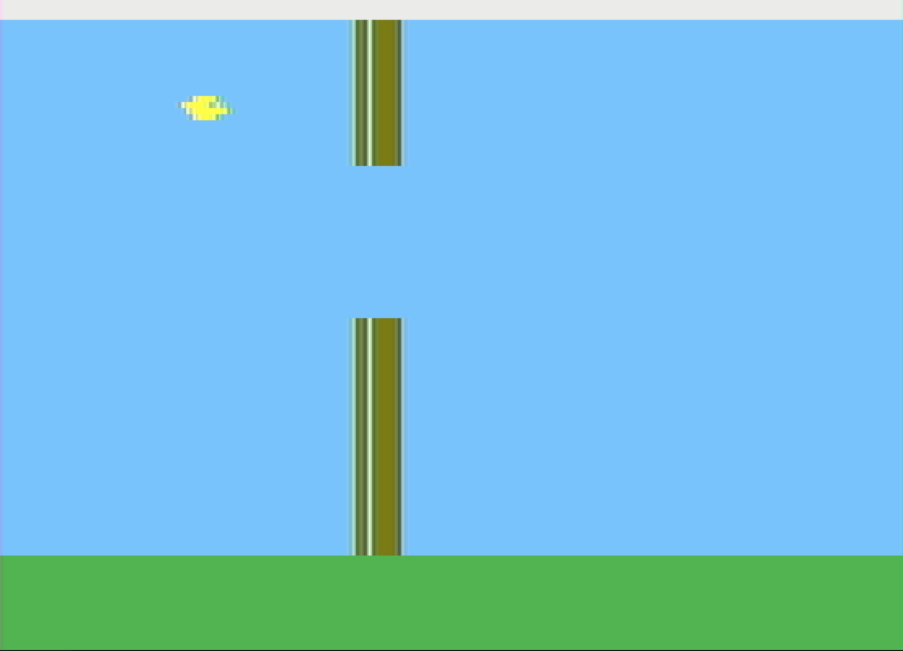

# Flappy 2600

My first try making game for the Atari 2600, the code is awful and the game is buggy.

You can play it [here](https://8bitworkshop.com/v3.5.2/embed.html?p=vcs&r=TFpHAAAQAAAAAfHWr7yiAQsMEhV42KIAiqjKmkjQ%2B6mehQmpFIUGqXiFgKkehQepuIWBqQGFgqnvhYOpBYUKqaaFhKkKhYWpQIWGqc2Fh6nxhYipEYWJqTKFiqkOhQKFAErQ%2BakrjZYCpYEY6QjJKLAhGGkVwhqlgBjpAhjFhJADTJPwEkUIGMWFsAwFBcmwDAYPyQiwChICqUiFCUwA8KWBogAgtfGpKKIBFcIQLIAC0AbmgBUipYkKChhliRhpEYWJpYYYySCwE6nFDASJpYbQDwwCmUzj8AwGnMaGxoCkgoiEgtAuDALHpYE46QGFgckY0B%2BlgwppAIWDDALhpYkpPmkehYUYZYqFhKWKGBIbiqn%2FhQ2FDoUPqQ6FCK2EAtD7hQKFKoUBogjKhRIFqQASEp6FCKWDhRuisKnwhQ2p4IUO5ITQBxISG0xj8eSF0AQSVakwEhMAhQ6FAsoMBh6KOOWAaQiQCKixh4UcTIrxEhccDAkf0LESe6nIhQgMBnuiJRJP%2B6lChQFMR%2FCFAjjpD7D8qLkP%2FZUglRBgPP7%2F%2F3p%2BPBg8Pn%2F%2F%2Bv48GP8VHxUfFR8VHxUfFR8VHxUfFR8VHxUfFR8VHxUfFR8VHxUfFR8VHxUfFR8VHxUfFR8VHBUFcGBQQDAgEADw4NDAsKCQDB%2BHFR8VHxUeFRwA8BUi).

